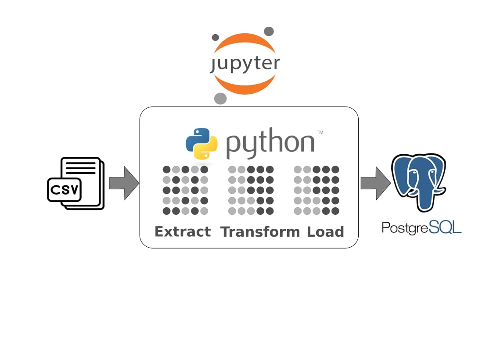

# csv_to_postgres

# *Overview*
Project repo to demonstrate Data Ingestion using Python, CSV file as Data Source and PostgreSQL as database. Data ingestion using Jupyter Notebook with pandas library to process it. Using small data CSV file because the purpose of this project to demonstrate Data Ingestion in simplest way that actually will work also with Big Data.
# *Prerequisites*
To follow along this project we need to make it available on system, below requirements:
```bash
pip install jupyter-notebook
```
```python3
pip install pandas, psycopg2
```
# *Project Flow*
Data ingestion from CSV to postgreSQL:
1. Import necessary python library -- pandas, sqlachemy, psycopg2
   ```python3
   import pandas as pd
   from sqlalchemy import create_engine
   import psycopg2 
   ```
3. [E]xtract CSV to pandas data frame
   ```python3
   df = pd.read_csv('CO2 Emission Country.csv')
   ```
5. [T]transform pandas -- remove unnecessary string & convert object to numeric data type
   ```python3
   # Remove unnecessary string
   df['% of global total'] = df['% of global total'].str.replace('%', '', regex=False)

   # Convert object to numeric data type
   df['% of global total'] = pd.to_numeric(df['% of global total'], errors='raise')
   ```
7. [L]oad pandas to postgreSQL
   ```python3
   # create database connection
   db_config = {
    'host':'localhost',
    'database':'csvpostgresql',
    'user':'postgres',
    'password':'postgres'
   }
   ```
   ```python3
   ...
   engine = create_engine(f"postgresql+psycopg2://{db_config['user']}:{db_config['password']}@{db_config['host']}:{db_config.get('port', 5432)}/{db_config['database']}")
    df.to_sql(table_name, engine, if_exists='append', index=False)
   ...
   ```
